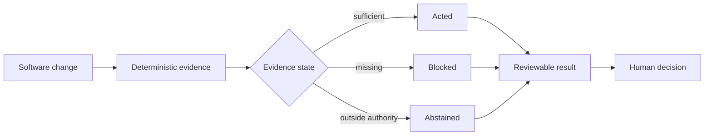

# QA Agents

QA Agents is a public case study about evidence-led software-quality investigation.

The project asks what should happen after a software change but before an agent acts. Its answer is to establish deterministic evidence first, make missing evidence visible, give each role a bounded responsibility, and preserve the human decision.

This repository is a demonstration surface, not an installable QA operating substrate. It contains architecture, role boundaries, and one sanitized Little Bytes investigation artifact. Production profiles, memory, schemas, prompts, routing, policies, fingerprints, permissions, and runtime orchestration are intentionally withheld.

## The demonstrated loop



## Five bounded roles

| Role | Bounded responsibility | Does not imply |
| --- | --- | --- |
| Beacon | Frame the QA question and required evidence | Automatic dispatch |
| Inspector | Compare available evidence with the review question | Complete coverage |
| Scribe | Draft a test only after expected behavior is accepted | Permission to merge |
| Patch | Investigate a failing test or suspected test defect | Permission to change product behavior |
| Lookout | Perform a bounded exploratory mission | Unrestricted browsing or action |

The role names are responsibility labels. They are not public agent prompts or executable specifications.

## Little Bytes case study

A controlled pricing change left the existing tests passing while the changed behavior lacked regression coverage. The public artifact preserves what changed at a high level, what evidence existed, what remained missing, and which human-reviewed next action was suggested.

```text
pricing change
→ existing tests pass
→ changed behavior lacks evidence
→ investigation records a coverage gap
→ a regression test is suggested
→ no agent, patch, test, or merge is automatically dispatched
```

Explore [the case study](demo.md) and the [sanitized artifact](../examples/demo-runs/little-bytes-pricing.json).

## What remains public

- evidence-before-action architecture
- acted / blocked / abstained outcomes
- the five bounded role concepts
- detection, investigation, repair, and review boundaries
- Little Bytes as a controlled application-under-test
- a static, synthetic investigation artifact
- lessons and trade-offs from the prototype

## Intentionally withheld

- application profiles and accumulated domain knowledge
- agent prompts and operating specifications
- KB schemas, migrations, and durable runtime memory
- routing tables, gap taxonomies, fingerprints, thresholds, and decision policies
- CLIs, execution runners, consumer contracts, and publication integration
- tool permissions, runtime manifests, and orchestration machinery

## Lessons

Passing tests are evidence, not proof of sufficient coverage. Agent confidence is weaker than deterministic artifacts. A recommended next action is not the same as an action taken. Clear authority boundaries make both automation and abstention more trustworthy.
